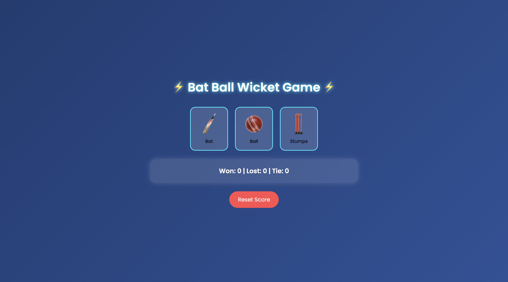

```
<!-- 🎉 PROJECT BANNER -->
<p align="center">
  
</p>

# 🏏 Bat Ball Wicket – Cricket Game  
A fun and interactive cricket-themed mini-game built using **HTML, CSS, and JavaScript**.

Inspired by the classic hand-cricket game — choose between **Bat**, **Ball**, or **Stumps** and compete against the computer!

---

## 🚀 Live Demo  
👉 **Play the Game Here:**  
### 🔗 https://ciphernomad.github.io/Cricket-Game/

---

<!-- ## 🎬 Demo GIF  
Add a short gameplay GIF in `images/demo.gif` and it will auto-load here:

 -->

---

## 🖼️ Screenshot  
Here’s how the game looks:



---

## ✨ Features

### 🎨 **Beautiful UI**
- Glass-effect modern layout  
- Neon hover buttons  
- Smooth animations  
- Animated cricket splash screen  

### 🧠 **Game Logic**
- Computer generates random selections  
- Real-time result rendering  
- Scoreboard updates instantly  

### 💾 **Persistent Score**
- Score auto-saves using `localStorage`  
- Reset button included  

### 📱 **Responsive**
- Works on mobile, tablet, and desktop  

---

## 🛠️ Technologies Used

| Technology | Purpose |
|-----------|---------|
| **HTML5** | Base structure |
| **CSS3** | UI styling + animations |
| **JavaScript (ES6)** | Game logic, DOM handling |
| **LocalStorage** | Score persistence |
| **GitHub Pages** | Deployment |

---

## 📂 Project Structure

```

Cricket-Game/
│── images/
│   ├── bat.png
│   ├── ball.png
│   ├── stump.png
│   ├── stadium.png
│   ├── demo.png
│       
|
│── index.html
│── style.css
│── script.js
│── README.md

````

---

## 🔧 How to Run Locally

1. Clone repository:
   ```bash
   git clone https://github.com/CipherNomad/Cricket-Game.git
````

2. Navigate into folder:

   ```bash
   cd Cricket-Game
   ```

3. Open:

   ```
   index.html
   ```

   in any browser.

That's it — no installations needed!

---

## 🌐 Re-Deploy Instructions (GitHub Pages)

If you update the project, just run:

```bash
git add .
git commit -m "update"
git push
```

Your live game auto-updates at:
🔗 **[https://ciphernomad.github.io/Cricket-Game/](https://ciphernomad.github.io/Cricket-Game/)**

---

## 🤝 Contributing

Feel free to fork the project and submit PRs!

---

## ⭐ Support

If you like this project, please ⭐ star the repo — it motivates future improvements!


